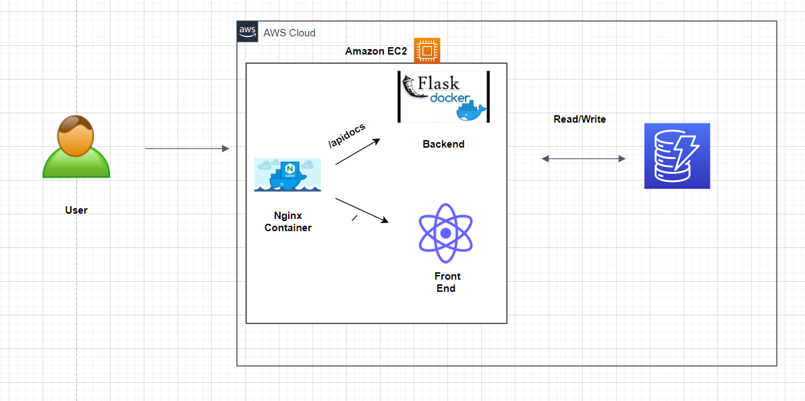

# E Stock Market IIHT Case Study

E-StockMarket Application is a Restful Microservice application, where it allows users to manage the stocks like create, view stock price details and company details


### Architecture Diagram


### Tech Stack

**FrontEnd:** `React`

**Backend:** `Python` `Flask`

**Cloud Services:** `AWS` `CloudFormation` `IAM` `EC2`

**Database:** `AWS DynamoDB`

**Others:** `Docker` `Nginx` `Docker-Compose`


### To Do

- [x]  Create the Backend Endpoints
- [x]  Test the Backend Endpoints using Postman & Swagger UI
- [ ]  Create the FrontEnd using React
- [x]  Dockerize the application
- [x]  Run the Dockerize application and the Test it
- [x]  Create the AWS DynamoDB using Cloudformation
- [x]  Deploy and Run the application on AWS EC2 
- [ ]  Try to optimize few of the operations like scan()
- [ ]  Store the Logs in the Logstash
- [x]  Run Application using Nginx
- [ ]  Write the Tests Cases using Pytest

### API Reference
`Access the Swagger UI to test all Endpoints: http://localhost:5000/apidocs/index.html`

#### POST  register the company

```http
  POST /api/v1.0/market/company/register
```

| Parameter | Type     | Description                    |
| :-------- | :------- | :----------------------------- |
| `C_CODE` | `string` | **Required**. Company Code |
| `C_NAME` | `string` | **Required**. Company Name |
| `C_TURNOVER` | `number` | **Required**. Company Turnover must be > 10 crore |
| `C_WEBSITE` | `string` | **Required**. Company Website |
| `C_CEO` | `string` | **Required**. Company CEO name |
| `C_EXCHANGE` | `string` | **Required**. Company Exchange ex: NSE/BSE |


#### POST  Add the company stock price

```http
  POST /api/v1.0/market/stock/add/<companycode>
```

| Parameter    | Type               | Description                                       |
|:-------------|:-------------------|:--------------------------------------------------|
| `C_CODE`     | `string - in Path` | **Required**. Company Code                        |
| `S_NAME`     | `string - in Body` | **Required**. Stock Price                         |


#### GET  the company stock price based on timeframe

```http
  GET /api/v1.0/market/stock/get/<companycode>/<startdate>/<enddate>
```


| Parameter     | Type               | Description                                       |
|:--------------|:-------------------|:--------------------------------------------------|
| `companycode` | `string - in Path` | **Required**. Company Code                        |
| `startdate`   | `string - in Path` | **Required**. Stock Price                         |
| `enddate`     | `string - in Path` | **Required**. Stock Price                         |


#### GET  the company data along with latest stock price

```http
  GET /api/v1.0/market/company/info/<companycode>
```


| Parameter     | Type               | Description                                       |
|:--------------|:-------------------|:--------------------------------------------------|
| `companycode` | `string - in Path` | **Required**. Company Code                        |


#### GET  All the company latest stock price

```http
  GET /api/v1.0/market/company/getall
```

#### DELETE  the company data along with stock prices

```http
  DELETE /api/v1.0/market/company/delete/<companycode>
```


| Parameter     | Type               | Description                                       |
|:--------------|:-------------------|:--------------------------------------------------|
| `companycode` | `string - in Path` | **Required**. Company Code                        |


## Run Locally on Linux OS

Clone the project

```bash
  git clone git@github.com:Sumanshu-Nankana/E-Stock-Market.git
```

Go to the project directory and Setup few things

```bash
  cd E-Stock-Market
  update AWS_SECRET_KEY_ID` & `AWS_SECRET_ACCESS_KEY` in backend/settings.py
  with that IAM user - who has AWS Administrator access. (Or atleast Cloudformation, DynamoDB and S3)
```

```commandline
- Open AWS
- Go to CloudFormation
- Create the Stack - using template : infrastructure/stack.yaml
```
Start the application using Docker-Compose

```bash
    docker-compose up
```

Browse the Swagger UI and explore any Endpoints

```bash
  http://localhost:5000/apidocs/index.html
```


## AWS Cloud Deployment

Follow the below steps - to deploy/run this project on AWS EC2

```bash
  Create a Security group with inbound ports: 'Custom TCP Port: 80 and SSH : 22'
  Create a KEY-PAIR and download it locally
  Create an EC2 Instance with ami ubuntu and attach above Security group and Key-Pair
  Logon to EC2 from local 'ssh -i key.pem ubuntu@<public-ip>'
  sudo apt-get update -y
  sudo apt-get install docker-compose
  git clone https://github.com/Sumanshu-Nankana/E-Stock-Market.git
  cd E-Stock_Market
  nano docker-compose.yml
  'update the SERVER_NAME=0.0.0.0  with SERVER_NAME=<EC2-Public-IP>'
  update the AWS KEYS in 'backend/settings.py'
  create the Cloudformation Stack with template from 'infrastructure/stack.yml'
  sudo docker-compose up
  And Access the Swagger UI 'http://<EC2-Public-Ip>/apidocs'
```


## Additional Notes

I am using "gunicorn" wsgi server, which not runs on windows. 
So to run on windows, you need to update the Dockerfile with
```
CMD ["python", "wsgi.py"]
```
